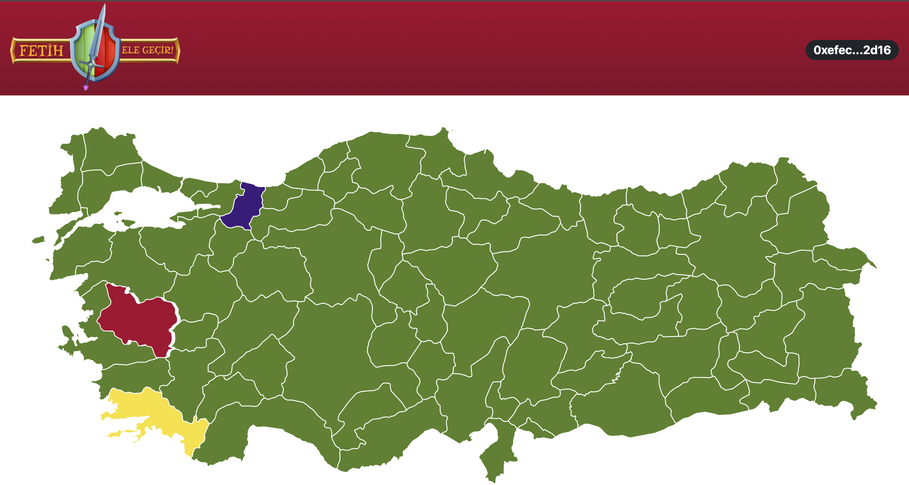

# FETİH

Fetih, blockchain tabanlı bir strateji oyunudur.

UI tarafında React.js, backend tarafında C# Dotnet Core 3.1, akıllı sözleşmeler tarafında solidity teknolojilerini kullanacağız.

Üyeler ve Rolleri;

- Yusuf Sina Yıldız / Team Lead - Blockchain Developer
- Samet Yazıcı / Front-end Developer
- Vahit Atakan Küpçüoğlu / Back-end Developer
- Neslihan Akbulut / Designer

## PROJE NASIL ÇALIŞTIRILIR

### INTERFACE

Bilgisayarınızda Node.js (v17.3.0) kurulu olması gerekmekte. Node.js kurulu ise interface/fetih içerisinde

    npm install

    npm start

yapmanız ile kullanıcı arayüz uygulaması çalışacaktır.

Test URL: https://fetih-yusufsina.vercel.app/

### BACKEND

Bilgisayarınızda dotnet SDK 3.1 kurulu olmalı. Visual Studio ile proje dizinini açıp direkt kestrel üzerinde çalıştırabilirsiniz.

Test URL: https://fetih.somee.com/

### CONTRACTS

Akıllı sözleşmelere contracts klasörünün içerisinden erişebilirsiniz.

Kontratlar Rinkeby Network üzerinde yayındadır. 

Oracle Client Kontrat: https://rinkeby.etherscan.io/address/0xa82B968B338E8f7eEE1dCB289c8718244B72b412

Fetih Kontrat: https://rinkeby.etherscan.io/address/0xC24b7f6C71ee0d330FB492c9b30f9f08088044F6
